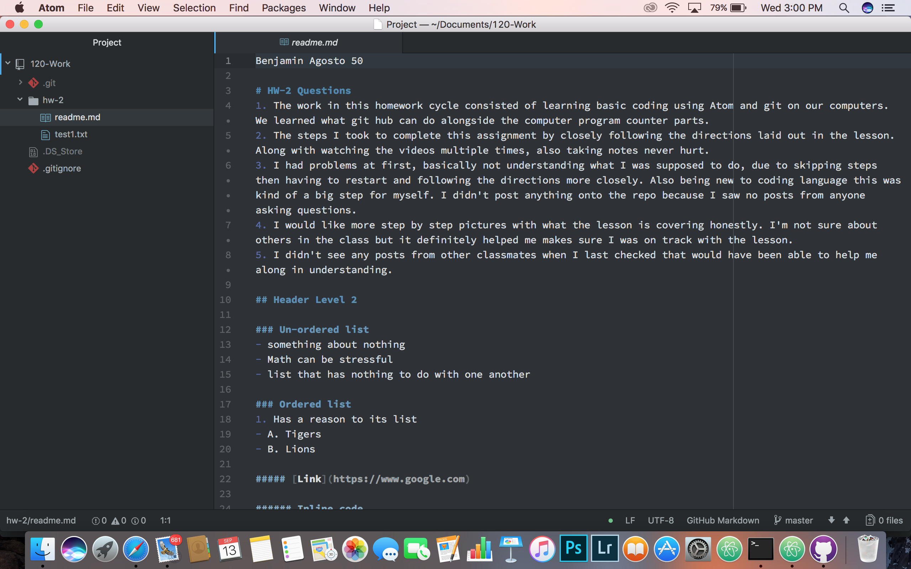

Benjamin Agosto 50

# HW-2 Questions
1. The work in this homework cycle consisted of learning basic coding using Atom and git on our computers. We learned what git hub can do alongside the computer program counter parts.
2. The steps I took to complete this assignment by closely following the directions laid out in the lesson. Along with watching the videos multiple times, also taking notes never hurt.
3. I had problems at first, basically not understanding what I was supposed to do, due to skipping steps then having to restart and following the directions more closely. Also being new to coding language this was kind of a big step for myself. I didn't post anything onto the repo because I saw no posts from anyone asking questions.
4. I would like more step by step pictures with what the lesson is covering honestly. I'm not sure about others in the class but it definitely helped me makes sure I was on track with the lesson.
5. I didn't see any posts from other classmates when I last checked that would have been able to help me along in understanding.

## Header Level 2

### Un-ordered list
- something about nothing
- Math can be stressful
- list that has nothing to do with one another

### Ordered list
1. Has a reason to its list
- A. Tigers
- B. Lions

##### [Link](https://www.google.com)

###### Inline code
```javascript
var s = "Javascript syntax highlighting";
alert(s);
```

**bold**
*asterisk*


